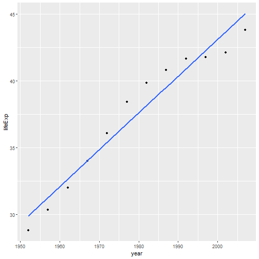

Predict Population for a Country
========================================================
author: Sangeeth
date: 11th Nov 2020
autosize: true

Application
========================================================

The app is used to predict the population of a country.

- Select one of 142 countries
- The available population data is from 1952-2007
- Predict population uptil 2030 using linear regression.
- Data source : Gapminder Dataset

Peek at the Gapminder Dataset
========================================================


```
# A tibble: 5 x 6
  country     continent  year lifeExp      pop gdpPercap
  <fct>       <fct>     <int>   <dbl>    <int>     <dbl>
1 Afghanistan Asia       1952    28.8  8425333      779.
2 Afghanistan Asia       1957    30.3  9240934      821.
3 Afghanistan Asia       1962    32.0 10267083      853.
4 Afghanistan Asia       1967    34.0 11537966      836.
5 Afghanistan Asia       1972    36.1 13079460      740.
```

Sample Plot
========================================================



Software Used
========================================================

R Libraries
- ggplot
- shiny
- gapminder

Hosting
- Github
- shiny.io

THANK YOU
